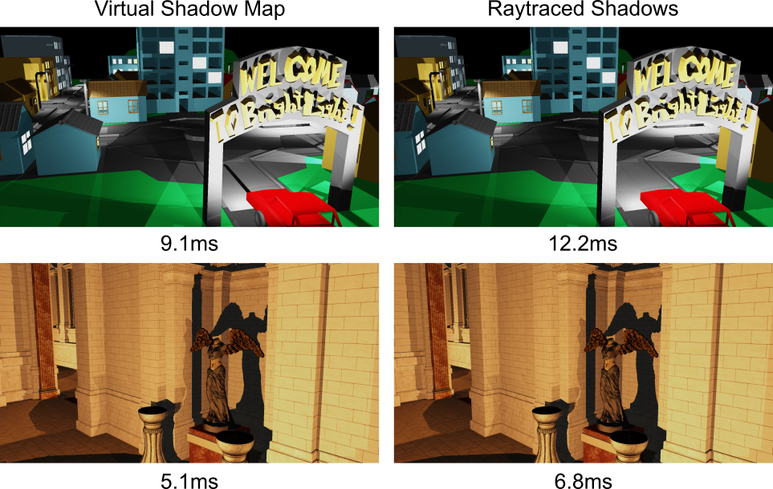

# Raytraced Virtual Shadow Maps (using Falcor 5.1)

This project implements a shadow map technique for many omnidirectional lights. Shadow maps are not rasterized, instead the depth of shadow rays is cached. Only relevant parts of the shadow map are mapped to memory (using DX12's reserved resources). The scene is analyzed to adaptively determine the shadow map resolution for each pixel.


## Render Passes

- can be found in Source/RenderPasses
- the render pass .pyscene files are in the folder VirtualRaytracedShadowMap_Passes

| Name                | Description                                                  |
| ------------------- | ------------------------------------------------------------ |
| RTVirtualShadowMaps | caches shadow rays in shadow map (RTVirtualShadowMaps.pyscene) |
| RTShadows           | spawns shadow ray for each light (RTShadows.pyscene)         |


## Prerequisites
- Windows 10 version 20H2 (October 2020 Update) or newer, OS build revision .789 or newer
- Visual Studio 2019
- [Windows 10 SDK (10.0.19041.0) for Windows 10, version 2004](https://developer.microsoft.com/en-us/windows/downloads/windows-10-sdk/)
- A GPU which supports DirectX Raytracing, such as the NVIDIA Titan V or GeForce RTX
- NVIDIA driver 466.11 or newer

Optional:
- Windows 10 Graphics Tools. To run DirectX 12 applications with the debug layer enabled, you must install this. There are two ways to install it:
    - Click the Windows button and type `Optional Features`, in the window that opens click `Add a feature` and select `Graphics Tools`.
    - Download an offline package from [here](https://docs.microsoft.com/en-us/windows-hardware/test/hlk/windows-hardware-lab-kit#supplemental-content-for-graphics-media-and-mean-time-between-failures-mtbf-tests). Choose a ZIP file that matches the OS version you are using (not the SDK version used for building Falcor). The ZIP includes a document which explains how to install the graphics tools.
- NVAPI, CUDA, OptiX (see below)

## Build Configurations
Falcor comes with 2 rendering backends: Native D3D12 and Slang GFX (supporting D3D12 and Vulkan). The Slang GFX backend is fully functional but considered experimental. To select the backend, the following build configurations are available:
- `ReleaseD3D12` / `DebugD3D12`: Native D3D12 backend (**recommended**)
- `ReleaseGFX-D3D12` / `DebugGFX-D3D12`: Slang GFX backend using D3D12 (experimental)
- `ReleaseGFX-VK` / `DebugGFX-VK`: Slang GFX backend using Vulkan (experimental)

## Citation
If you use Falcor in a research project leading to a publication, please cite the project.
The BibTex entry is

```bibtex
@Misc{Kallweit22,
   author =      {Simon Kallweit and Petrik Clarberg and Craig Kolb and Tom{'a}{\v s} Davidovi{\v c} and Kai-Hwa Yao and Theresa Foley and Yong He and Lifan Wu and Lucy Chen and Tomas Akenine-M{\"o}ller and Chris Wyman and Cyril Crassin and Nir Benty},
   title =       {The {Falcor} Rendering Framework},
   year =        {2022},
   month =       {3},
   url =         {https://github.com/NVIDIAGameWorks/Falcor},
   note =        {\url{https://github.com/NVIDIAGameWorks/Falcor}}
}
```
